# QR Attendance 

<div align="center">
  
</div>

[](https://flutter.dev/)
[](https://dart.dev/)
[](https://flutter.dev/)
[](LICENSE)

## ✨ Overview

**QR Attendance** is a comprehensive, modern Flutter application for managing attendance using QR codes. Designed for **schools and colleges**, it provides a complete attendance management solution with separate interfaces for teachers, parents, and students. Built with cutting-edge UI/UX principles and powered by QR code technology, it offers an intuitive, efficient, and visually polished solution for educational institutions.

### 🎯 Target Audience
- **Schools** (Primary, Secondary, High Schools)
- **Colleges** (Community Colleges, Universities)
- **Educational Institutions** of all sizes
- **Training Centers** and **Academies**

### 🎯 Key Features

- **🔐 Multi-Role Authentication**: Separate interfaces for teachers, parents, and students
- **📱 QR Code Scanning**: Quick attendance marking with mobile/web QR scanning
- **📊 Real-time Analytics**: Live attendance statistics and comprehensive reports
- **🎨 Modern UI/UX**: Beautiful, responsive design with smooth animations
- **📱 Cross-Platform**: Native support for Android, iOS, and Web browsers
- **🔒 Secure**: JWT-based authentication and data encryption
- **📈 Scalable**: Built with clean architecture for easy maintenance
- **📋 Excel Integration**: Automated Excel sheet generation for students and parents
- **🔔 Smart Notifications**: Real-time alerts and absence reports
- **📱 Self-Service**: Student self-attendance during open windows

## 🎨 User Interfaces

QR Attendance provides three distinct, role-based interfaces designed for different user needs. Each interface features a modern, intuitive design with smooth animations and responsive layouts.

### 👩‍🏫 Teacher Interface

**Purpose**: Complete classroom management and attendance control system for educators.

**Key Features**:
- **Dashboard Overview**: Real-time attendance statistics and class management
- **QR Code Generation**: Create and manage class QR codes for attendance sessions
- **Live Attendance Control**: Enable/disable self-attendance windows for students
- **Class Management**: View and manage multiple classes with detailed analytics
- **Attendance History**: Comprehensive tracking of student attendance patterns
- **Report Generation**: Export attendance data and generate detailed reports

**Main Screens**:
- **Teacher Home**: Central dashboard with quick access to all features
- **Class Management**: View and select classes for attendance sessions
- **QR Scanner**: Scan student QR codes for manual attendance marking
- **Attendance History**: Detailed view of past attendance records
- **Reports**: Generate and export attendance analytics

**Workflow**:
1. Login and select class from dashboard
2. Generate or scan class QR code
3. Enable attendance window for students
4. Monitor real-time attendance updates
5. Close session and review results
6. Generate reports and export data

### 👨‍👩‍👧 Parent Interface

**Purpose**: Monitor children's attendance and receive real-time updates.

**Key Features**:
- **Child Dashboard**: View attendance status for all registered children
- **Real-time Notifications**: Instant alerts for attendance updates
- **Weekly Statistics**: Track attendance patterns and trends
- **Detailed Reports**: Access comprehensive attendance history
- **Absence Alerts**: Receive notifications when children are marked absent

**Main Screens**:
- **Parent Home**: Overview of all children's attendance status
- **Weekly Stats**: Visual charts showing attendance trends
- **Notifications**: Real-time alerts and absence reports
- **Detailed Reports**: Comprehensive attendance history and analytics 

**Workflow**:
1. Login with parent credentials
2. View dashboard showing all children's status
3. Select child to see detailed attendance information
4. Review weekly statistics and trends
5. Check notifications for important updates
6. Access detailed reports for specific periods

### 🎓 Student Interface

**Purpose**: Simple, one-tap attendance recording for students.

**Key Features**:
- **One-Tap Attendance**: Record attendance with a single button press
- **QR Code Scanning**: Scan class QR codes for attendance verification
- **Gallery Upload**: Alternative method to load QR codes from photos
- **Real-time Status**: See immediate feedback on attendance submission
- **Location Verification**: GPS-based attendance validation

**Main Screens**:
- **Student Login**: Simple authentication with student credentials
- **Attendance Request**: Main interface for recording attendance
- **QR Scanner**: Camera-based QR code scanning
- **Status Display**: Real-time feedback on attendance status

**Workflow**:
1. Login with student credentials
2. View class information and attendance status
3. Scan class QR code or load from gallery
4. Tap "Record Attendance" button
5. Receive immediate confirmation
6. Return to class activities

## 📸 UI Screenshots

### 🎨 Complete UI Gallery

#### 🚀 App Launch
<div align="center">
  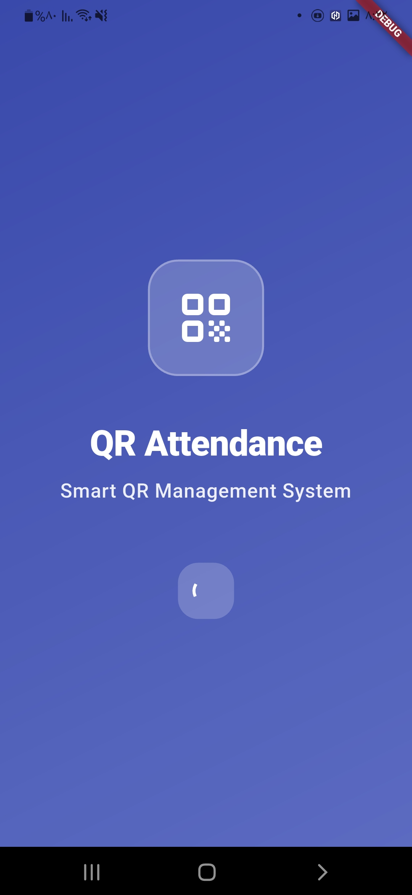
  <div><sub>Beautiful animated splash screen with gradient background</sub></div>
</div>

#### 👩‍🏫 Teacher Interface
<table>
  <tr>
    <td align="center">
      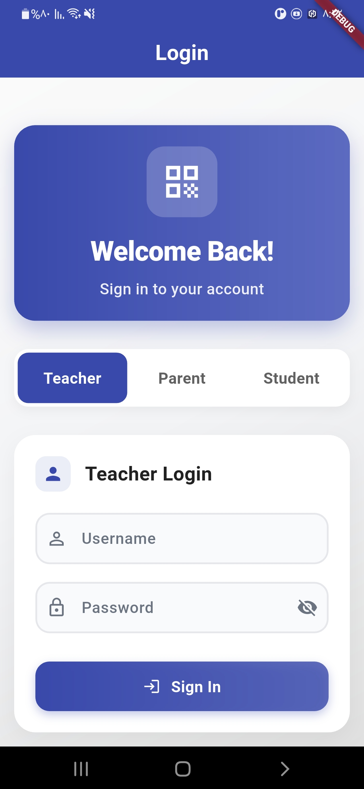
      <div><sub>Teacher Login</sub></div>
    </td>
    <td align="center">
      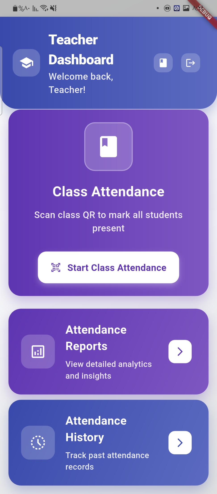
      <div><sub>Teacher Dashboard</sub></div>
    </td>
  </tr>
  <tr>
    <td align="center">
      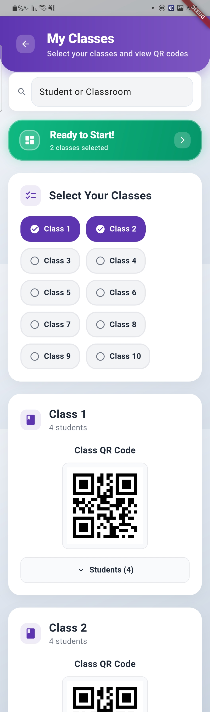
      <div><sub>Class Management</sub></div>
    </td>
    <td align="center">
      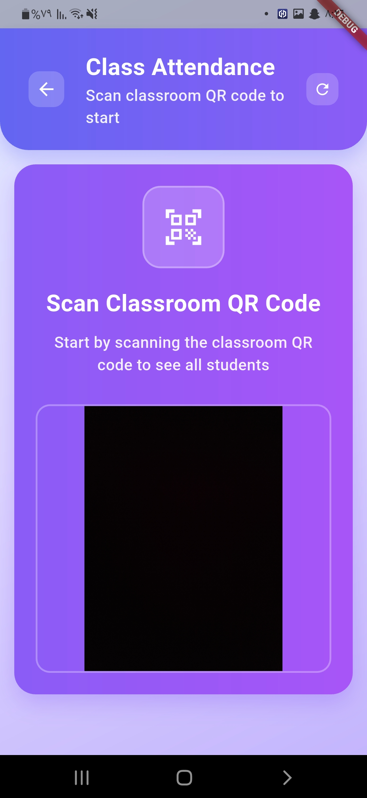
      <div><sub>QR Scanner</sub></div>
    </td>
  </tr>
  <tr>
    <td align="center">
      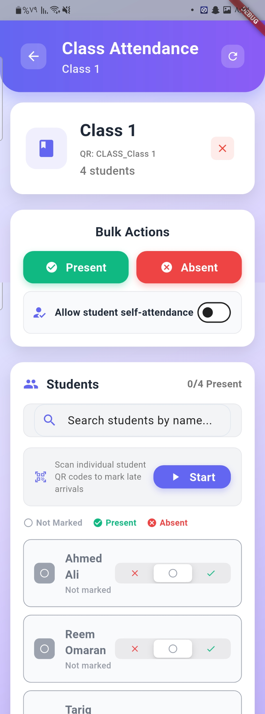
      <div><sub>Class Attendance</sub></div>
    </td>
    <td align="center">
      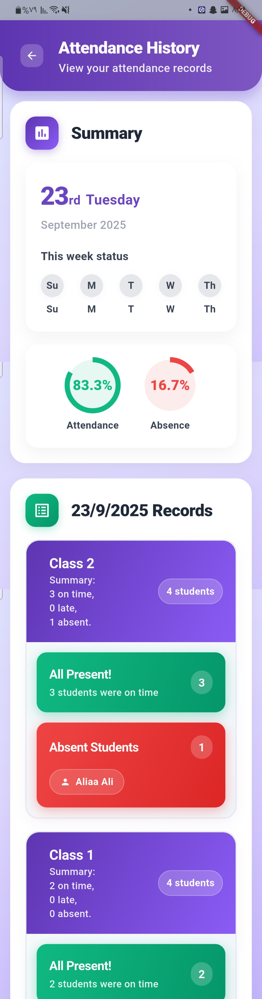
      <div><sub>Attendance History</sub></div>
    </td>
  </tr>
  <tr>
    <td align="center">
      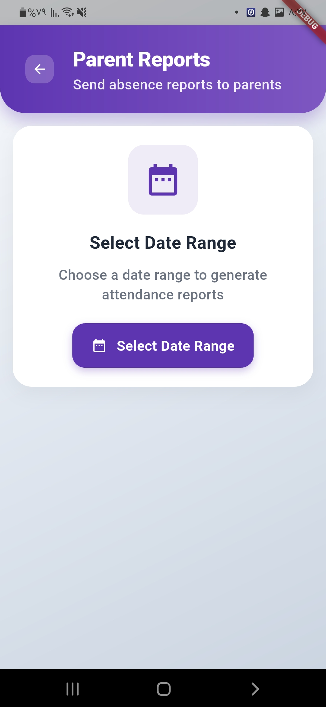
      <div><sub>Teacher Reports</sub></div>
    </td>
  </tr>
  <tr>
    <td align="center">
      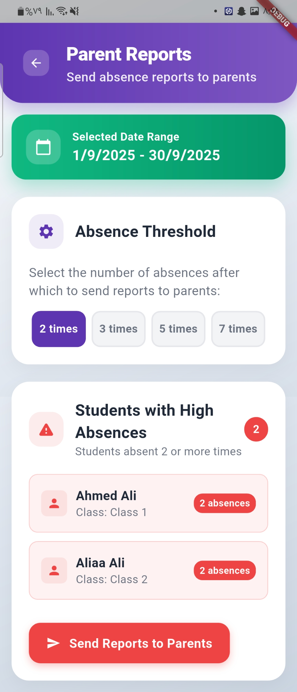
      <div><sub>Teacher Reports 2</sub></div>
    </td>
    <td align="center">
      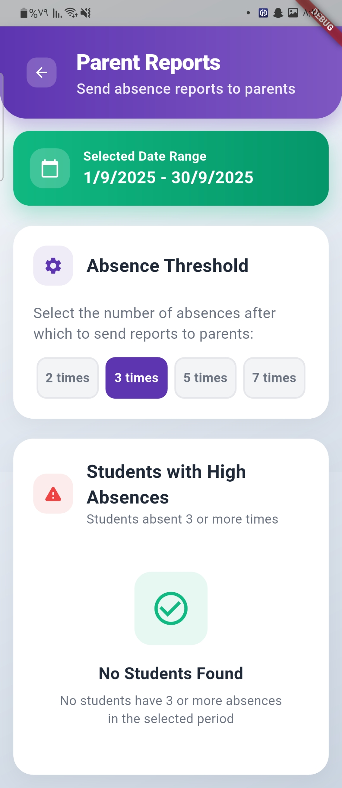
      <div><sub>Teacher Reports 3</sub></div>
    </td>
    <td align="center">&nbsp;</td>
  </tr>
</table>

#### 👨‍👩‍👧 Parent Interface
<table>
  <tr>
    <td align="center">
      
      <div><sub>Parent Login</sub></div>
    </td>
    <td align="center">
      
      <div><sub>Parent Dashboard</sub></div>
    </td>
    <td align="center">
      
      <div><sub>Notifications</sub></div>
    </td>
  </tr>
  <tr>
    <td align="center">
      
      <div><sub>Weekly Statistics</sub></div>
    </td>
    <td align="center">
      
      <div><sub>Parent Reports</sub></div>
    </td>
  </tr>
  <tr>
    <td align="center" colspan="3">
      
      <div><sub>Parent Reports 2</sub></div>
    </td>
  </tr>
</table>

#### 🎓 Student Interface
<table>
  <tr>
    <td align="center">
      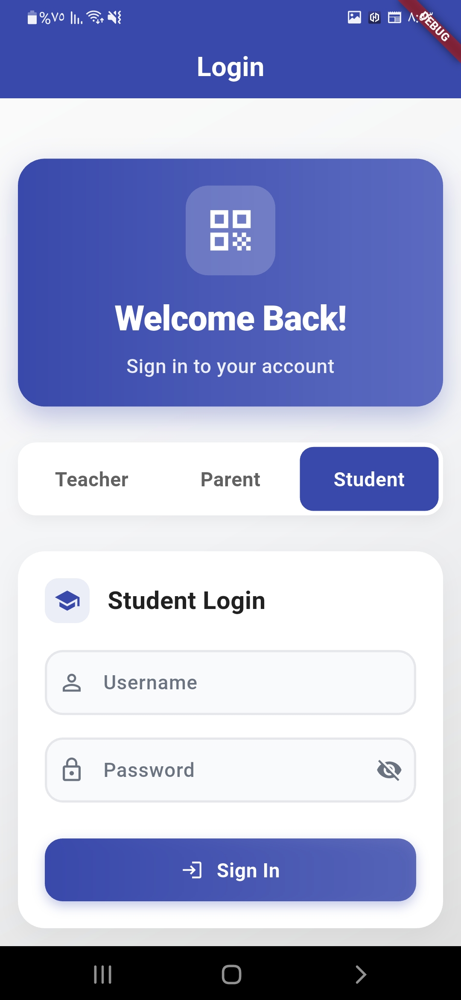
      <div><sub>Student Login</sub></div>
    </td>
    <td align="center">
      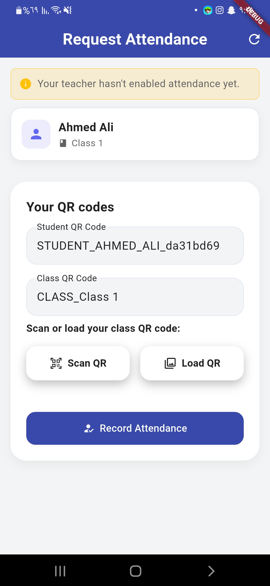
      <div><sub>Attendance Request</sub></div>
    </td>
    <td align="center">
      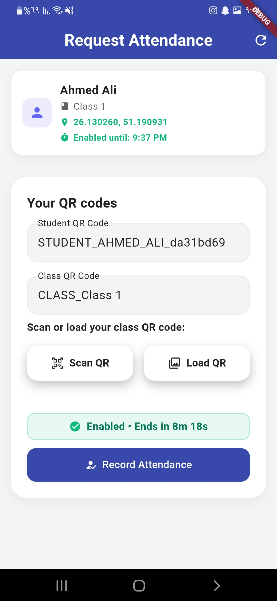
      <div><sub>QR Scanning</sub></div>
    </td>
  </tr>
  <tr>
    <td align="center">
      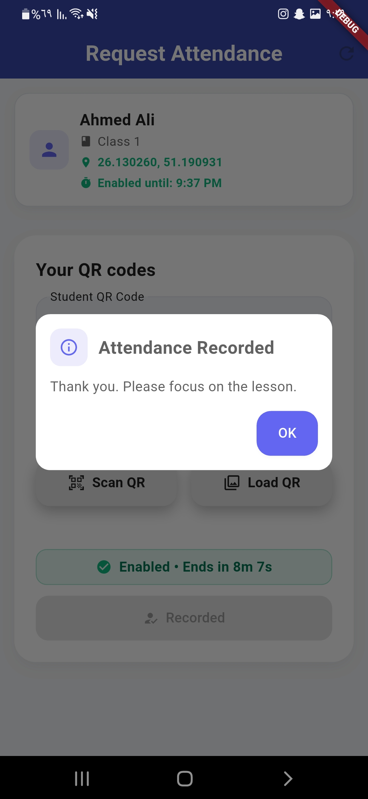
      <div><sub>Gallery Upload</sub></div>
    </td>
    <td align="center" colspan="2">
      <div><strong>📱 One-Tap Attendance Recording</strong></div>
      <div><sub>Simple interface for quick attendance submission</sub></div>
    </td>
  </tr>
</table>

> 📁 **Complete UI Gallery**: See all screenshots organized by user type in the [`ui/`](ui/) folder:
> - **[Teacher Screens](ui/teacher/)** - Complete teacher workflow and management
> - **[Parent Screens](ui/parent/)** - Parent dashboard, reports, and notifications  
> - **[Student Screens](ui/student/)** - Student attendance request system

## 🛠️ Technology Stack

### Frontend
- **Flutter 3.9+** with Material Design 3
- **Cross-platform**: Android, iOS, and Web support
- **QR Code Integration**: Mobile scanner and web-based scanning
- **Real-time Updates**: Live attendance tracking and notifications

### Backend
- **Django 4.2+** with REST API
- **Database**: SQLite (development) / PostgreSQL (production)
- **Authentication**: JWT-based secure authentication
- **Excel Integration**: Automated report generation

## ✨ Key Features

### 🎨 Modern UI Design
- **Beautiful Gradients**: Multi-color gradient backgrounds and cards
- **Smooth Animations**: Staggered animations and interactive feedback
- **Material 3 Design**: Latest Material Design principles
- **Responsive Layout**: Optimized for all screen sizes

### 📱 Smart QR Code System
- **Dual Scanning Methods**: Camera scanning and gallery upload
- **Real-time Processing**: Instant attendance marking and validation
- **Location Verification**: GPS-based attendance validation
- **Fallback Support**: Multiple ways to scan QR codes

## 🏗️ Architecture

### Frontend Structure
- **Role-based Screens**: Separate interfaces for teachers, parents, and students
- **Reusable Components**: Custom widgets for consistent UI
- **API Integration**: RESTful communication with backend
- **State Management**: Built-in Flutter state management

### Backend Structure
- **Django REST API**: RESTful endpoints for all operations
- **Database Models**: Structured data for users, classes, and attendance
- **Authentication**: JWT-based secure authentication
- **Report Generation**: Excel and PDF export capabilities

## 🎨 Design Features

### Visual Design
- **Modern Color Scheme**: Professional indigo, purple, and teal color palette
- **Smooth Animations**: Staggered animations and interactive feedback
- **Glassmorphism Effects**: Semi-transparent elements with subtle borders
- **Material 3 Design**: Latest Material Design principles

### 🎨 Color Palette

The app uses a carefully crafted color scheme designed for educational environments:

| Color Name | Hex Code | Usage | Importance |
|------------|----------|-------|------------|
| **Primary Indigo** | `#3949AB` | Main brand color, navigation, primary actions | ⭐⭐⭐⭐⭐ |
| **Teal** | `#26A69A` | Parent interface accent, success states | ⭐⭐⭐⭐ |
| **Deep Purple** | `#5E35B1` | Teacher interface accent | ⭐⭐⭐⭐ |
| **Success Green** | `#10B981` | Present/Success states | ⭐⭐⭐⭐⭐ |
| **Error Red** | `#EF4444` | Absent/Error states | ⭐⭐⭐⭐⭐ |
| **Text Primary** | `#212121` | Main text color | ⭐⭐⭐⭐⭐ |


### User Experience
- **Intuitive Navigation**: Role-based interfaces for different user types
- **Real-time Updates**: Live attendance tracking and notifications
- **Responsive Design**: Optimized for all screen sizes
- **Accessibility**: Clear visual hierarchy and touch-friendly interactions


## 🚀 Getting Started

### Prerequisites
- **Flutter SDK**: 3.9+ with Dart 3.9+
- **Python**: 3.8+ (recommended 3.11+)
- **Django**: 4.2+
- **Database**: SQLite (development) / PostgreSQL (production)

### Installation

1. **Clone the Repository**
   ```bash
   git clone <your-repo-url>
   cd school_qr
   ```

2. **Frontend Setup**
   ```bash
   # Install Flutter dependencies
   flutter pub get
   
   # Run the app
   flutter run
   ```

3. **Backend Setup**
   ```bash
   cd backend
   
   # Create virtual environment
   python -m venv venv
   source venv/bin/activate  # On Windows: venv\Scripts\activate
   
   # Install dependencies
   pip install -r requirements.txt
   
   # Run migrations
   python manage.py migrate
   
   # Start development server
   python manage.py runserver
   ```

### Configuration
- Update API endpoints in `lib/services/api_service.dart`
- Configure database connection in backend settings
- Set up environment variables for production

## 📊 Features

### Report Generation
- **Excel Export**: Automated Excel generation with attendance data
- **PDF Reports**: Formatted reports for official use
- **Real-time Analytics**: Live attendance statistics and trends
- **Custom Periods**: Flexible date range reporting

### Platform Support
- **Mobile**: Android and iOS native apps
- **Web**: Browser-based interface with QR scanning
- **Cross-platform**: Consistent experience across all devices


