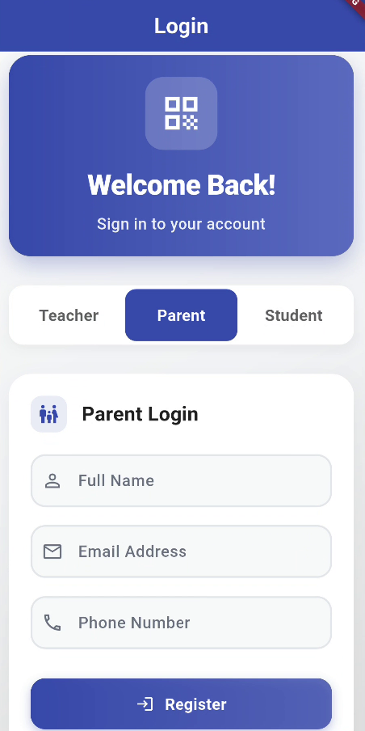
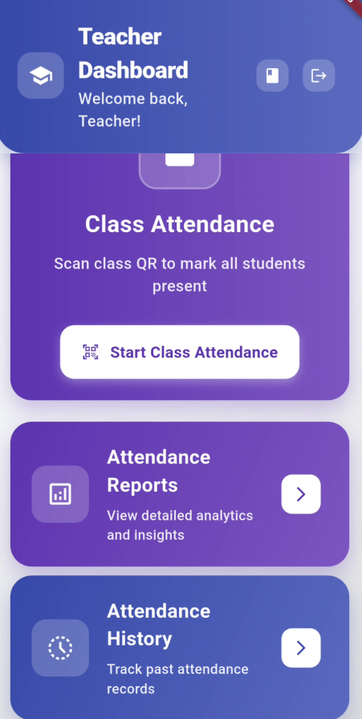
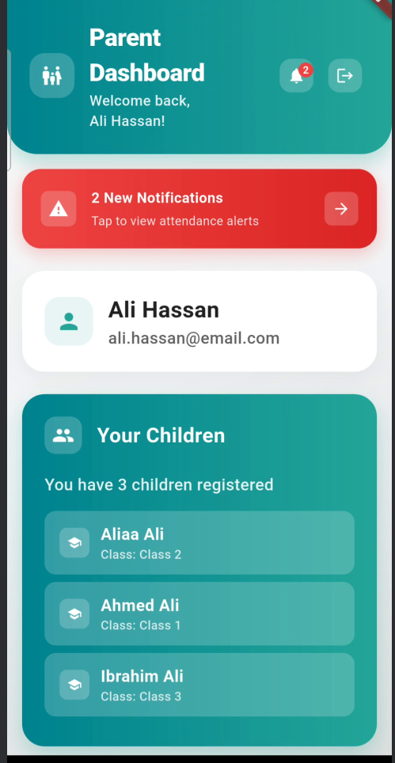
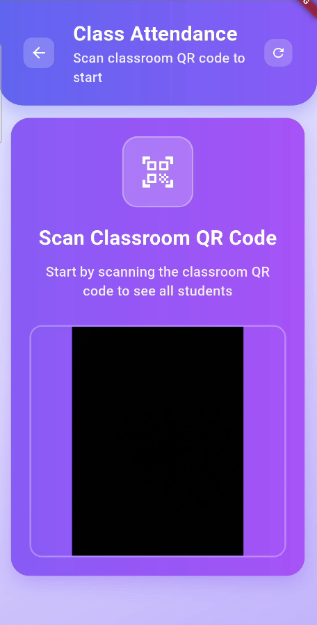

# 🎓 QR Attendance — QR Code Based Attendance Management System

[](https://flutter.dev/)
[](https://dart.dev/)
[](https://flutter.dev/)
[](LICENSE)

## ✨ Overview

**QR Attendance** is a comprehensive, modern Flutter application for managing attendance using QR codes. Designed for **schools and colleges**, it provides a complete attendance management solution with separate interfaces for teachers, parents, and students. Built with cutting-edge UI/UX principles and powered by QR code technology, it offers an intuitive, efficient, and visually polished solution for educational institutions.

### 🎯 Target Audience
- **Schools** (Primary, Secondary, High Schools)
- **Colleges** (Community Colleges, Universities)
- **Educational Institutions** of all sizes
- **Training Centers** and **Academies**

### 🎯 Key Features

- **🔐 Multi-Role Authentication**: Separate interfaces for teachers, parents, and students
- **📱 QR Code Scanning**: Quick attendance marking with mobile/web QR scanning
- **📊 Real-time Analytics**: Live attendance statistics and comprehensive reports
- **🎨 Modern UI/UX**: Beautiful, responsive design with smooth animations
- **📱 Cross-Platform**: Native support for Android, iOS, and Web browsers
- **🔒 Secure**: JWT-based authentication and data encryption
- **📈 Scalable**: Built with clean architecture for easy maintenance
- **📋 Excel Integration**: Automated Excel sheet generation for students and parents
- **🔔 Smart Notifications**: Real-time alerts and absence reports
- **📱 Self-Service**: Student self-attendance during open windows

## 📸 Screenshots

### 🎨 UI Gallery
View our comprehensive UI screenshots in the [`ui/`](ui/) folder:

- **[Authentication Screens](ui/README.md#-authentication-screens)** - Login interfaces for all user types
- **[Teacher Interface](ui/README.md#-teacher-screens)** - Complete teacher workflow and management
- **[Parent Interface](ui/README.md#-parent-screens)** - Parent dashboard, reports, and notifications
- **[Student Interface](ui/README.md#-student-screens)** - Student attendance request system

### 📱 Key Screenshots

<table>
  <tr>
    <td align="center">
      
      <div><sub>App Launch</sub></div>
    </td>
    <td align="center">
      
      <div><sub>Teacher Login</sub></div>
    </td>
    <td align="center">
      
      <div><sub>Parent Login</sub></div>
    </td>
  </tr>
  <tr>
    <td align="center">
      
      <div><sub>Teacher Dashboard</sub></div>
    </td>
    <td align="center">
      
      <div><sub>Parent Dashboard</sub></div>
    </td>
    <td align="center">
      
      <div><sub>QR Scanner</sub></div>
    </td>
  </tr>
</table>

> 📁 **Complete UI Gallery**: See all screenshots in the [`ui/`](ui/) folder with detailed descriptions and workflows.

## 📦 Technology Stack & Packages

### 🎯 Frontend (Flutter)
- **Framework**: Flutter 3.9+ with Dart 3.9+
- **State Management**: Built-in Flutter state management
- **UI Components**: Material Design 3 with custom theming
- **Animations**: Flutter Animation Framework

#### 📱 Key Flutter Packages
```yaml
dependencies:
  # Core Flutter
  flutter: sdk
  
  # HTTP & API
  http: ^1.1.0                    # HTTP requests
  shared_preferences: ^2.2.2      # Local storage
  
  # QR Code & Camera
  qr_code_scanner: ^1.0.1         # QR code scanning
  mobile_scanner: ^3.5.6          # Advanced QR scanning
  qr_flutter: ^4.1.0             # QR code generation
  
  # UI & Navigation
  table_calendar: ^3.0.9         # Calendar widgets
  flutter_svg: ^2.0.9            # SVG support
  cached_network_image: ^3.3.0   # Image caching
  
  # Utilities
  intl: ^0.19.0                  # Internationalization
  url_launcher: ^6.2.1           # External links
  permission_handler: ^11.0.1    # Device permissions
```

### 🔧 Backend (Python/Django)
- **Framework**: Django 4.2+ with Django REST Framework
- **Database**: SQLite (development) / PostgreSQL (production)
- **Authentication**: JWT tokens with Django REST Framework
- **API**: RESTful API with comprehensive endpoints

#### 🐍 Key Python Packages
```txt
# Core Framework
Django==4.2.7
djangorestframework==3.14.0
django-cors-headers==4.3.1

# Database & ORM
psycopg2-binary==2.9.7          # PostgreSQL adapter
django-extensions==3.2.3        # Django extensions

# Authentication & Security
djangorestframework-simplejwt==5.3.0
django-oauth-toolkit==1.7.1

# QR Code & Image Processing
qrcode==7.4.2                   # QR code generation
Pillow==10.1.0                  # Image processing
openpyxl==3.1.2                 # Excel file handling

# Data Processing
pandas==2.1.3                   # Data analysis
numpy==1.26.4                   # Numerical computing

# Development & Testing
python-decouple==3.8            # Environment variables
```

### 📊 Excel Integration
- **Student Reports**: Automated Excel generation with attendance data
- **Parent Reports**: Customized reports with child attendance history
- **Teacher Analytics**: Class-wise attendance statistics
- **Export Features**: CSV and Excel export capabilities

## 🌐 Platform Support

### 📱 Mobile Platforms
- **Android**: API level 21+ (Android 5.0+)
- **iOS**: iOS 12.0+ with Xcode 14+
- **Features**: Native camera integration, push notifications, offline support

### 💻 Web Platform
- **Browsers**: Chrome, Firefox, Safari, Edge (latest versions)
- **Features**: Web-based QR scanning, responsive design, PWA support
- **Deployment**: Static hosting (Netlify, Vercel, GitHub Pages)

### 🖥️ Desktop Support
- **Windows**: Windows 10+ with Flutter desktop
- **macOS**: macOS 10.14+ with Flutter desktop
- **Linux**: Ubuntu 18.04+ with Flutter desktop

## 🚀 What's New

### ✅ Renaming and Generalization
- App renamed to **QR Attendance** (more general for schools and colleges)
- Updated display names across platforms:
  - Android: `android:label` → "QR Attendance"
  - iOS: `CFBundleDisplayName` and `CFBundleName` → "QR Attendance"
  - Web: `manifest.json` `name`/`short_name` and page `<title>` → "QR Attendance"
  - Flutter: `MaterialApp.title` and splash title → "QR Attendance"
- Codebase folder name remains `school_qr` to avoid breaking tooling; can be changed later if required

### 🎨 **Revolutionary UI Transformation**
This version introduces a complete visual overhaul that transforms the app from a basic functional interface to a **commercial-grade, visually stunning application**:

- **🌈 Beautiful Gradients**: Multi-color gradient backgrounds and cards
- **✨ Smooth Animations**: Staggered animations, fade effects, and interactive feedback
- **🎭 Glassmorphism**: Modern semi-transparent elements with subtle borders
- **🎨 Material 3 Design**: Latest Material Design principles with custom theming
- **📱 Responsive Layout**: Optimized for all screen sizes and orientations

### 🛠️ **Custom Widget Library**
- **GradientCard**: Beautiful gradient background cards with shadows
- **GlassCard**: Semi-transparent glassmorphism effects
- **CustomButton**: Animated buttons with touch feedback
- **CustomTextField**: Enhanced form inputs with focus animations
- **SearchTextField**: Modern search interface with clear functionality

## 🏗️ System Architecture

### **Frontend (Flutter)**
```
lib/
├── main.dart                       # App entry with theme and routes
├── screens/                        # UI screens
│   ├── login_screen.dart          # Authentication interface
│   ├── parents/                   # Parent-facing screens
│   │   ├── parent_home_screen.dart
│   │   ├── parent_notifications_screen.dart
│   │   ├── parent_reports_screen.dart
│   │   └── parent_weekly_stats_screen.dart
│   ├── teachers/                  # Teacher-facing screens
│   │   ├── teacher_home_screen.dart
│   │   ├── teacher_classes_screen.dart
│   │   ├── teacher_reports_screen.dart
│   │   ├── teacher_attendance_history_screen.dart
│   │   └── class_attendance_screen.dart
│   ├── qr_scanner_screen.dart     # Mobile QR scanning
│   └── web_qr_scanner_screen.dart # Web QR scanning
├── widgets/                        # Reusable UI components
│   ├── custom_button.dart
│   └── custom_text_field.dart
├── models/                         # Data models
├── services/                       # API and business logic
└── utils/                          # Helpers
```

Note: Screens are now grouped by audience under `screens/parents/` and `screens/teachers/`.

### **Backend (Python/Django)**
```
backend/
├── manage.py                # Django management
├── requirements.txt         # Python dependencies
├── school_attendance/       # Main Django app
│   ├── settings.py         # Configuration
│   ├── urls.py             # URL routing
│   └── wsgi.py             # WSGI configuration
├── api/                     # REST API endpoints
├── models/                  # Database models
└── views/                   # Business logic
```

## 🎨 UI/UX Features

### **1. Enhanced Theme & Color Scheme**
- **Primary Colors**: Indigo (`#6366F1`), Purple (`#8B5CF6`), Pink (`#EC4899`)
- **Success Colors**: Emerald (`#10B981`) for positive actions
- **Warning Colors**: Amber (`#F59E0B`) for alerts
- **Error Colors**: Red (`#EF4444`) for errors
- **Material 3 Integration**: Full Material Design 3 implementation

### **2. Animated Splash Screen**
- **Gradient Background**: Beautiful multi-color gradient from top-left to bottom-right
- **Staggered Animations**: Logo fade-in with elastic scale, title slide-in
- **Glassmorphism Elements**: Semi-transparent containers with subtle borders
- **Enhanced Typography**: Larger, bolder text with better letter spacing

### **3. Modern Login Interface**
- **Gradient Header**: Eye-catching header with school icon and welcome message
- **Interactive User Selector**: Animated toggle between Teacher and Parent modes
- **Custom Form Fields**: Enhanced text inputs with icons and validation
- **Smooth Transitions**: Fade and slide animations for better user experience

### **4. Enhanced Dashboards**
- **Teacher Dashboard**: Blue/Indigo theme with QR scanner prominence
- **Parent Dashboard**: Green theme for growth and success associations
- **Custom App Bars**: Gradient headers with user information
- **Statistics Cards**: Quick overview of attendance metrics
- **Recent Activity Feed**: Timeline of recent actions

## 🔧 Technical Features

### **QR Code Management**
- **Mobile Scanning**: Native camera integration for mobile devices
- **Web Scanning**: Browser-based QR scanning for desktop users
- **Real-time Processing**: Instant attendance marking and validation
- **Error Handling**: Graceful fallbacks for scanning failures

### **Authentication System**
- **JWT Tokens**: Secure, stateless authentication
- **Role-based Access**: Separate interfaces for different user types
- **Session Management**: Persistent login states
- **Secure Logout**: Proper token cleanup and session termination

### **Data Management**
- **Real-time Updates**: Live data synchronization
- **Offline Support**: Graceful handling of network issues
- **Data Validation**: Input sanitization and error handling
- **Performance Optimization**: Efficient data loading and caching

## 📱 User Experience

### **For Teachers**
- **Quick Attendance Marking**: Scan QR codes to mark attendance instantly
- **Dashboard Overview**: View attendance statistics and recent activities
- **Student Management**: Access student information and attendance history
- **Report Generation**: Generate attendance reports and analytics

### **For Parents**
- **Child Monitoring**: Track attendance of registered children
- **Real-time Updates**: See attendance status as it happens
- **Historical Data**: Access attendance history and patterns
- **Communication**: Stay informed about child's school attendance


## 🧭 Interfaces & Detailed Workflows

This application provides three role-based interfaces. Each role exposes only the actions relevant to that user while maintaining a consistent design language and navigation model.

### 👩‍🏫 Teacher Interface

**Purpose**: Set up classes/sessions, control when attendance can be recorded, scan QR codes, and review/report results.

**How teachers take attendance (two modes after selecting a class/session)**
1) Teacher-managed recording (after scanning the class QR)
   - Teacher decides the baseline state for the class:
     - Mark all Present, then manually mark absent students; or
     - Mark all Absent, then manually mark present students
   - Late students are only those who scan their QR during the open window after the baseline is set
   - Duplicate scans during the same window are ignored and do not change prior decisions

2) Student self-service window (after scanning the class QR)
   - Teacher taps “Enable Attendance” to open the window
   - Teacher optionally displays the session QR; students scan it or submit via their student screen
   - Each student submission is validated against the active class/session and recorded
   - Submissions outside the open window/classroom are rejected with a clear message

**Daily Records & History**
- Daily view shows per-class counts (present/absent/late) and individual student statuses
- History view provides filters by class/date range and supports exporting summaries

**Reporting to Parents**
- Teachers can send reports/notices to parents when a child’s absences reach a selected threshold (e.g., 3, 5, or 7 absences)
- Reports can include per-day breakdowns and overall attendance rates

**Typical Teacher Workflow**
1. Log in as Teacher
2. Select the class/session from `Teacher Home`
3. Scan or open the class QR, then tap “Enable Attendance”
4. Choose a mode:
   - Teacher-managed: set baseline (all present/absent) and adjust individuals; or
   - Self-service: keep window open so students record themselves
5. Monitor live counts (present/absent/late)
6. Tap “Close Attendance” when done
7. Review `History` and use `Reports` to export/share; optionally notify parents above the absence threshold

### 🎓 Student Interface

**Purpose**: Allow students to record their attendance during the teacher’s open window.

**Key Capabilities**
- After login, the student sees their details; one tap records attendance
- Receive immediate feedback (recorded, not-open-yet, closed, invalid)
- Attempts outside the open window are rejected with a clear message

**Typical Student Workflow**
1. Log in as Student
2. Review your displayed class/session info
3. Tap “Record Attendance” (one button) if your class window is open
4. See a confirmation on success, then return attention to class

**Validation & Rules**
- Submissions are accepted only for the specific class with an active window
- Duplicate submissions in the same session are deduplicated
- Camera permission required for scanning on supported devices

### 👨‍👩‍👧 Parent Interface

**Purpose**: Give parents visibility into their children’s attendance and provide timely notifications.

**Key Capabilities**
- Dashboard with daily counters (present/absent/late) per child
- Weekly trends and per-day drill-downs
- Notifications when the teacher sends reports for repeated absences and the child absences (daily)

**Typical Parent Workflow**
1. Log in as Parent
2. On `Parent Home`, pick a child to view today’s status and weekly trend
3. Tap into a date to see class-level details
4. Receive teacher-sent absence reports when thresholds are exceeded

**Validation & Rules**
- Parents only see linked children
- Read-only data; parents cannot modify records

### Access & Navigation Map
- Role-based login routes to `Teacher Home`, `Parent Home`, or `Login` for students/guests
- Core routes in the app:
  - `/teacher`, `/teacher/history`, `/teacher/reports`
  - `/parent`
  - `/student/request-attendance`


## 🚀 Getting Started

### **Prerequisites**

#### 📱 For Mobile Development
- **Flutter SDK**: 3.9+ with Dart 3.9+
- **Android Studio**: Latest version with Android SDK
- **Xcode**: 14+ (for iOS development)
- **VS Code**: Recommended IDE with Flutter extensions

#### 🔧 For Backend Development
- **Python**: 3.8+ (recommended 3.11+)
- **Django**: 4.2+
- **Database**: SQLite (development) / PostgreSQL (production)
- **Virtual Environment**: Python venv or conda

#### 🌐 For Web Development
- **Node.js**: 16+ (for web build tools)
- **Chrome/Edge**: Latest version for testing
- **Web Server**: Apache/Nginx (for production)

### **Run on real Android devices (LAN)**

If you run the backend on your PC and test on physical Android phones, point the app to your PC's LAN IP and allow HTTP or HTTPS accordingly.

1. Backend reachable on LAN
   - Start Django bound to all interfaces:
     ```bash
     cd backend
     python manage.py runserver 0.0.0.0:8000
     ```
   - In `backend/school_attendance/settings.py`:
     - Add your PC IP to `ALLOWED_HOSTS`, e.g. `ALLOWED_HOSTS = ['192.168.x.y', 'localhost']`
     - If you use CORS, allow your app origins.

2. Run Flutter with your LAN IP
   - Replace `192.168.x.y` with your PC/server IP:
     ```bash
     flutter run --dart-define=API_BASE_URL=http://192.168.x.y:8000/api
     ```
   - For web:
     ```bash
     flutter run -d chrome --dart-define=API_BASE_URL=http://192.168.x.y:8000/api
     ```

3. Android cleartext HTTP (if using http://)
   - If you hit a cleartext error, enable HTTP in `android/app/src/main/AndroidManifest.xml` on the `<application>` tag:
     ```xml
     <application
         android:usesCleartextTraffic="true">
     ```
   - Or use HTTPS for the backend.

Notes:
- Android emulator uses `http://10.0.2.2:8000/api` by default; iOS simulator/desktop/web use `http://localhost:8000/api` by default.
- You can always override with `--dart-define=API_BASE_URL=...`.

### **Installation**

1. **Clone the Repository**
   ```bash
   git clone <your-repo-url>
   cd school_qr
   ```

2. **Frontend Setup**
   ```bash
   # Install Flutter dependencies
   flutter pub get
   
   # Run the app
   flutter run
   ```

3. **Backend Setup**
   ```bash
   cd backend
   
   # Create virtual environment
   python -m venv venv
   source venv/bin/activate  # On Windows: venv\Scripts\activate
   
   # Install dependencies
   pip install -r requirements.txt
   
   # Run migrations
   python manage.py migrate
   
   # Start development server
   python manage.py runserver
   ```

4. **Database Configuration**
   - Update database settings in `backend/school_attendance/settings.py`
   - Run database migrations
   - Create superuser account

### **Configuration**
- Update API endpoints in `lib/services/api_service.dart`
- Configure database connection in backend settings
- Set up environment variables for production

## 🎭 Animation System

### **Splash Screen Animations**
- **Fade Animation**: Smooth opacity transitions (0.0 → 1.0)
- **Scale Animation**: Elastic bounce effects for logo (0.8 → 1.0)
- **Slide Animation**: Smooth upward movement for text (Offset(0, 0.3) → Offset.zero)

### **Screen Transitions**
- **Fade In**: Content appears with smooth opacity
- **Slide Up**: Elements slide in from bottom
- **Staggered Timing**: Different elements animate at different intervals

### **Interactive Animations**
- **Button Press**: Scale down on touch (1.0 → 0.95)
- **Focus States**: Subtle scaling for form fields (1.0 → 1.02)
- **Touch Feedback**: Smooth transitions for all interactive elements

## 🎨 Design Principles

### **Visual Hierarchy**
- Clear distinction between primary and secondary information
- Consistent spacing and typography throughout the app
- Logical grouping of related elements
- Progressive disclosure of information

### **Color Psychology**
- **Blue/Indigo**: Trust and professionalism (Teacher interface)
- **Green**: Growth and success (Parent interface)
- **Purple**: Creativity and innovation (Accent colors)
- **White**: Cleanliness and clarity (Background elements)

### **Modern UI Trends**
- **Glassmorphism**: Semi-transparent elements with subtle borders
- **Gradients**: Beautiful color transitions for visual appeal
- **Elevation**: Proper use of shadows for depth perception
- **Rounded Corners**: Modern, friendly appearance

## 📱 Responsive Design

### **Mobile-First Approach**
- Optimized for mobile devices and touch interactions
- Touch-friendly button sizes and spacing
- Proper spacing for thumb navigation
- Responsive card layouts that adapt to screen size

### **Cross-Platform Consistency**
- Unified design language across iOS, Android, and Web
- Consistent animations and transitions
- Platform-appropriate interactions and feedback
- Adaptive layouts for different screen orientations

## 🔧 Performance Optimizations

### **Animation Efficiency**
- Efficient animation controllers with proper disposal
- Optimized rebuild cycles and minimal widget tree changes
- Hardware acceleration for smooth animations
- Memory-efficient animation implementations

### **Data Management**
- Lazy loading of content and images
- Efficient API calls with proper caching
- Optimized database queries and indexing
- Background processing for non-critical operations

## 🚀 Future Enhancements

### **Planned Features**
- **Dark Mode Support**: Alternative color schemes and themes
- **Custom Branding**: School-specific themes and logos
- **Advanced Analytics**: Machine learning insights and predictions
- **Push Notifications**: Real-time alerts and reminders
- **Offline Mode**: Full offline functionality with sync

### **Technical Improvements**
- **Performance**: Advanced caching and optimization
- **Security**: Enhanced encryption and security measures
- **Scalability**: Microservices architecture and load balancing
- **Integration**: Third-party service integrations

## 🤝 Contributing

We welcome contributions! Please see our [Contributing Guidelines](CONTRIBUTING.md) for details.

### **Development Setup**
1. Fork the repository
2. Create a feature branch
3. Make your changes
4. Add tests if applicable
5. Submit a pull request

### **Code Style**
- Follow Flutter/Dart style guidelines
- Use meaningful variable and function names
- Add comments for complex logic
- Maintain consistent formatting


## 📊 Excel Integration Features

### 📋 Automated Report Generation
- **Student Reports**: Individual attendance records with detailed breakdowns
- **Parent Reports**: Child-specific attendance summaries and trends
- **Class Reports**: Teacher-generated class attendance analytics
- **Institution Reports**: School/college-wide attendance statistics

### 📈 Export Capabilities
- **Excel Format**: `.xlsx` files with formatted data and charts
- **CSV Export**: Raw data for further analysis
- **PDF Reports**: Formatted reports for official use
- **Scheduled Reports**: Automated report generation and distribution

### 🎯 Report Types
- **Daily Attendance**: Day-by-day attendance records
- **Weekly Summaries**: Weekly attendance patterns and trends
- **Monthly Analytics**: Comprehensive monthly attendance analysis
- **Custom Periods**: Flexible date range reporting
- **Absence Reports**: Detailed absence tracking and notifications

## 📊 Project Status

- **Current Version**: 2.0.0
- **Development Status**: Active Development
- **Last Updated**: October 2025
- **Next Release**: Q1 2025
- **Platform Support**: Android, iOS, Web
- **Target Audience**: Schools and Colleges

## 🎓 Educational Institution Support

### 🏫 School Features
- **Primary Schools**: Simple attendance tracking for young students
- **Secondary Schools**: Advanced analytics and parent communication
- **High Schools**: Comprehensive reporting and student management

### 🎓 College Features
- **Community Colleges**: Flexible class scheduling and attendance
- **Universities**: Large-scale attendance management
- **Training Centers**: Professional development tracking

### 📚 Institution Benefits
- **Reduced Administrative Work**: Automated attendance management
- **Improved Communication**: Real-time parent notifications
- **Better Analytics**: Data-driven insights for student success
- **Cost Effective**: Reduced paper-based processes
- **Scalable Solution**: Grows with your institution

---

**Made with ❤️ by the QR Attendance Team**

*Transforming education through technology, one QR code at a time.*